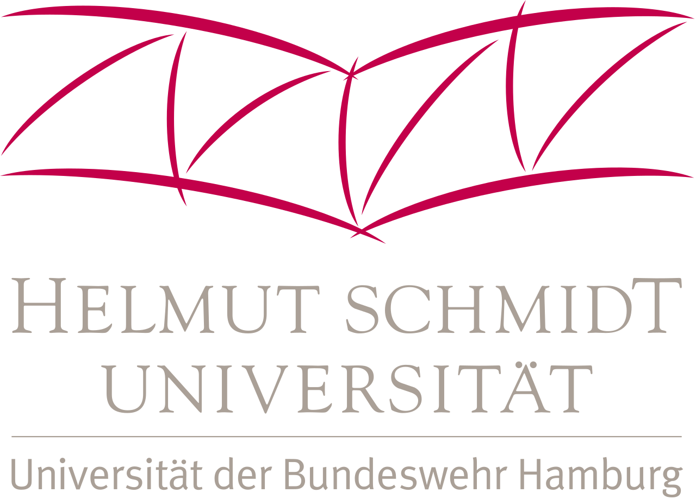

Hi I’m Jonas!
I am a PhD student in Artificial Intelligence for Cyber-Physical Systems at the Helmut-Schmidt University in Hamburg, Germany. 
I am working at the chair of Computer Science in Mechanical Engineering, at the department of Mechanical Engineering. 

My research focuses on messy planning problems that arise in the context of Cyber-Physical Systems. 
I am working on sub-symbolic algorithms that tackle such messy planning problems based on system observations, rather than system descriptions. 

Apart from that, I am interested in Cognitive Science and Neuroscience.
I love to draw inspiration from these domains for algorithmic solutions, encouraging a interdisciplinary view on real-life problems from those perspecitves. 

Below, you can find some information on my education, experience and recent activity in the scientific community. 

# Education

| | | |
|:-- |   |:--------------------------------------------------------------------------------------------- |
|  |  | **PhD Artificial Intelligence in Mechanical Engineering** from 2021 Helmut-Schmidt-University, Hamburg |
|   |  | **MSc Information Studies - Data Science** 2019 - 2020 University of Amsterdam, Amsterdam            |
|   |  | **MSc Business Administration and Engineering** 2017 - 2019 University of Bayreuth, Bayreuth        |
|  |  | **BSc Business Administration and Engineering** 2013 - 2017 University of Bayreuth, Bayreuth    |

# Work experience

| | | |
|:--- |  |:------------------------------------------------------------------------------------------------------------- |
|    |  | **PhD Student - Artificial Intelligence in Mechanical Engineering** from 2021 Helmut-Schmidt-University, Hamburg |
|   |  | **Student Research Assistant - Fraunhofer IPA** 2015 - 2019 University of Bayreuth, Bayreuth                      |

# Activities

Here, you can find some information on my activities in the research community.
For more information about my publications, visit my [publications page]({{site.baseurl}}/publications/).

### 2024
- Program committee ML4CPS Conference 2024, Berlin: [link](https://www.hsu-hh.de/imb/en/ml4cps)
- Invitee Dagstuhl Seminar 24031 - *Fusing Causality, Reasoning, and Learning for Fault Management and Diagnosis*: [link](http://www.dagstuhl.de/24031)
- Organizing committee CAIPI'24 Workshop - *Planning for Cyber-Physical Systems* @ AAAI 2024, Vancouver: [link](https://aaai.org/aaai-conference/aaai-24-workshop-list/#ws07)

### 2023
- Local committee ML4CPS Conference 2023, Hamburg: [link](https://www.hsu-hh.de/imb/en/ml4cps)

# Teaching

Here, you can find some information on courses I tutored. For more information have a look at the [teaching page]({{site.baseurl}}/teaching/).

### 2024

- Labs: Programming in C & Algorithms I

### 2023 

- Labs: Data Science
- Labs: Programming in C & Algorithms I 

### 2022 

- Labs: Embedded Systems
- Labs: Programming in C & Algorithms I

### 2021

- Labs: Embedded Systems 

